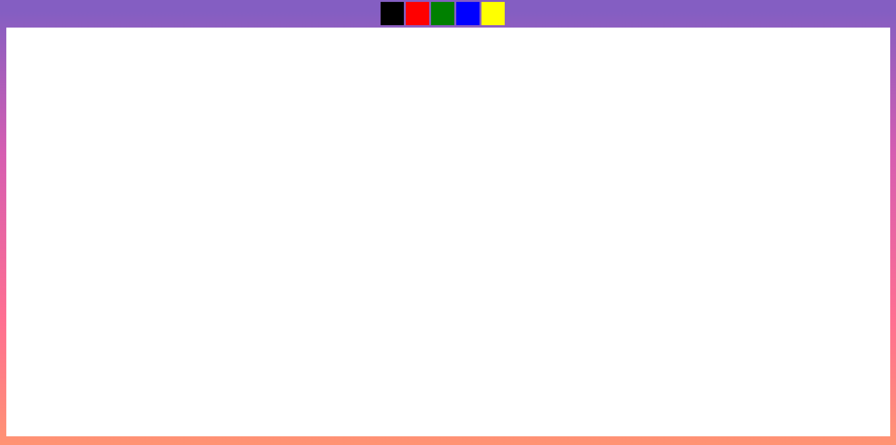
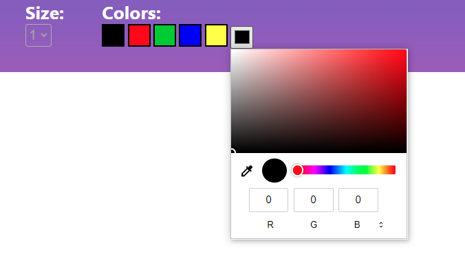
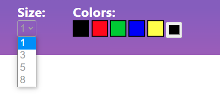

# whiteboard colaborativo

INTEGRANTES:

Felipe Galhardo RA - 160121, CP110TIN2

Henrique Casarini Firmino RA - 180185, CP110TIN2

Lucas Amorim de Paula RA- 180045, CP110TIN2

Rodolfo Augusto RA - 163627, CP110TIN2

Silvio Gonçalves RA - 180467, CP110TIN2


## Instruções para executar o projeto local

__Programas necessários__

Deve ter o *NodeJS* instalado na sua máquina.

Para verificar se o NodeJs já está instalado, execute o seguinte comando no terminal

```
    node -v
```

Esse comando deve retornar uma resposta com um número da versão, segue um exemplo:

```
v16.15.1
```

Caso retorne que o comando ´node´ não foi encontrado, acesse o link a seguir para fazer a instalação do NodeJS.
Instale na versão LTS disponível.
https://nodejs.org/en/download/

**Executando o programa**

Abra a pasta no terminal e faça a instalação das dependências, para isso execute o comando:

```
npm install
```

Também é necessário fazer a instalação do socket.io. Para isso execute o seguinte comando:

```
npm install socket.io
```

Após a instalação execute o comando 

```
npm start
```

e acesse http://localhost:3000 para acessar a página que o programa está executando.

## Executando como PWA

Para executar o projeto como PWA, basta rodar o "index.html" pelo live server no Visual Studio.

Infelizmente, no PWA não conseguimos fazer funcionar a parte de vários usuários utilizarem simultaneamente.

Mas, é possível fazer o download do PWA, interagir e desenhar com o Whiteboard.

## Descrição do Projeto

O projeto consiste em uma página web que permite que vários usuários acessem e possam desenhar simultanemante.

**Ferramentas**

Inicialmente, a ideia era de o usuário poder selecionar a espessura do traço entre 4 tamanhos disponíveis e também de haver uma paleta de cores, além das 5 cores principais, para que ele pudesse selecionar a cor que quisesse ou inserir o código RGB.

Acabamos descartando estas ideias e deixando somente as 5 opções de cores diferentes para escolher



Apenas para efeitos de ilustração, aqui pode-se observar o mockup para a escolha de cores pela paleta



E aqui, o mockup para escolha da espessura do traço

